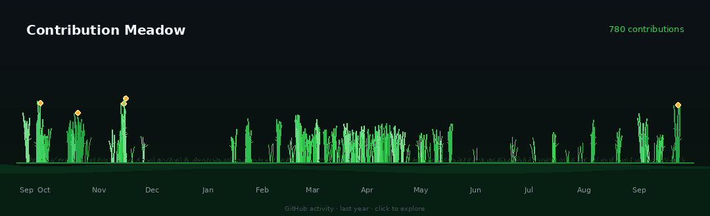

  

  
  
  

## 🛠 Tech Stack

### Languages

### Web & Application

### Game Development

### AI / Computer Vision

### Database & Infrastructure

  

##  Let's Connect

-  Email: natdanailunaha@gmail.com  
-  Interests: AI • Computer Vision • Edge AI • Healthcare • Smart Farming • FinTech  
-  Motto: Building technology that creates real-world impact.
